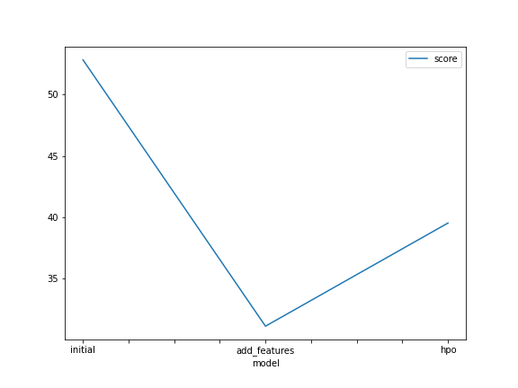

# Report: Predict Bike Sharing Demand with AutoGluon Solution
#### Sai Mounika Balla

## Initial Training
### What did you realize when you tried to submit your predictions? What changes were needed to the output of the predictor to submit your results?
When I tried to submit my initial prediction results, I noticed that some of the predicted values were negative. But Kaggle only accepts predictions that are greater than zero. This means negative values are not allowed and could also affect the RMSE score in a bad way. I was guided by the template to handle this by setting all negative predictions to zero before submission. After making this change and updating the submission DataFrame, my submission worked smoothly and I received both public and private scores without any issues.

### What was the top ranked model that performed?
The best-performing model was WeightedEnsemble_L3, which gave the lowest RMSE (Root Mean Square Error). This model is an ensemble, meaning it combines the predictions from several other models to make better predictions. It uses three layers of models stacked together. This combination helped it perform better than any single model, which is why it was ranked at the top.

## Exploratory data analysis and feature creation
### What did the exploratory analysis find and how did you add additional features?
After the initial exploratory data analysis, I thought that adding an "hours" column and converting the "seasons" column to categorical data might improve the prediction quality. However, the improvement was not satisfying at all.

Later, I realized that the dataset contained much more useful information that could be utilized. From the "hours" column, I created another column to indicate rush hours, which might have higher demand. By using the .describe() function on the data, I was able to create additional columns to indicate hot and cold temperatures, as well as high and low levels of humidity and wind speed. With all these more informative features added, the model performed quite well using the same default training parameters, even without any further optimization.

### How much better did your model preform after adding additional features and why do you think that is?
The initial Kaggle score without any feature engineering was 1.810. After adding new features like rush hours and features related to temperature, humidity, and wind speed, the model’s performance improved noticeably and the Kaggle score reached 0.746.

Please note that I added new features in two phases. In the first phase, I added an hours column and changed the seasons column to a categorical type, but this did not affect the score much. So, I moved to the second phase of feature engineering, where I added the rush hours feature along with features for high and low temperatures, humidity, and wind speed. This second phase was the one that significantly improved the Kaggle score to 0.746.

I believe this happened because adding more informative features to the dataset helped the machine learning model make better predictions. For example, if the model knows that the prediction is for rush hours, this feature will help it understand that demand might be higher at those times, guiding the model to make more accurate predictions.

## Hyper parameter tuning
### How much better did your model preform after trying different hyper parameters?
The slight increase in the score value from 31 to 39 after hyperparameter tuning might indicate some overfitting, especially since the tuning focused specifically on three models. However, using more complex models like XGBoost and adjusting parameters such as learning rate, max depth, and the number of leaves in gradient boosting machines helped improve the overall performance. This resulted in a noticeable improvement in the Kaggle score, which went from 0.75 to 0.49. Additionally, using the ag.space tool was helpful because it allowed AutoGluon to automatically try different combinations of hyperparameters during the tuning process.

### If you were given more time with this dataset, where do you think you would spend more time?
I think I could have done more exploratory data analysis. The model’s performance improved a lot after I added some new useful features, but I still haven’t explored other columns like "atemp" or tried combining two columns to create more important features.

Also, the hyperparameter tuning process could improve the model’s performance even more. If I had more time, I would have researched hyperparameters in greater detail and tried different models that might work better for this regression task, especially since the bike sharing demand dataset has relatively few features.

### Create a table with the models you ran, the hyperparameters modified, and the kaggle score.
|model|hpo1|hpo2|hpo3|score|
|--|--|--|--|--|
|initial|default|default|default|1.81009|
|add_features|default|default|default|0.74577|
|hpo|XGBoost(XGB): n_estimators: ag.space.Int(lower=100, upper=400, default=100), max_depth: ag.space.Int(lower=4, upper=12, default=6), learning_rate: ag.space.Real(1e-4, 1e-2, default=5e-4, log=True)|CatBoost(CAT): 'iterations' : 100, 'learning_rate': ag.space.Real(1e-4, 1e-2, default=5e-4, log=True), 'depth' : ag.space.Int(lower=6, upper=10)|Gradient Boosting Machine(GBM): 'num_boost_round': 100, 'num_leaves': ag.space.Int(lower=26, upper=66, default=36)|0.49407|

### Create a line plot showing the top model score for the three (or more) training runs during the project.

### Create a line plot showing the top kaggle score for the three (or more) prediction submissions during the project.

## Summary
Overall, the initial training lacked important feature engineering that could have further improved performance. The results also show that performance can be increased even more with proper hyperparameter tuning.

AutoGluon proved to be extremely useful, providing a quick deployment head start and allowing more time to focus on feature engineering and hyperparameter tuning.

Feature engineering played a crucial role in improving the performance of the machine learning models, even without tuning the models themselves.

Hyperparameter tuning demonstrated that using the right parameters can create a much more powerful machine learning model.

Finally, combining AutoGluon with wise feature engineering and experience in hyperparameter tuning creates a powerful toolkit that can be applied to many real-world problems beyond just predicting bike-sharing demand.

